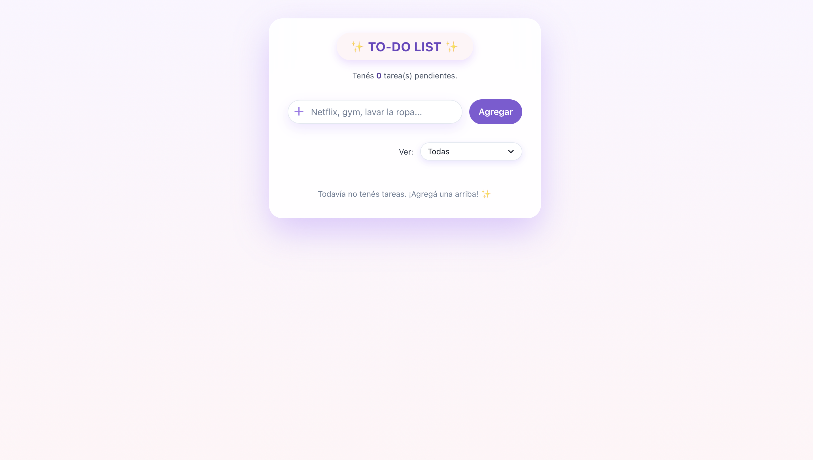
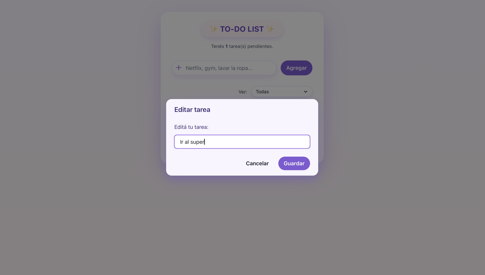
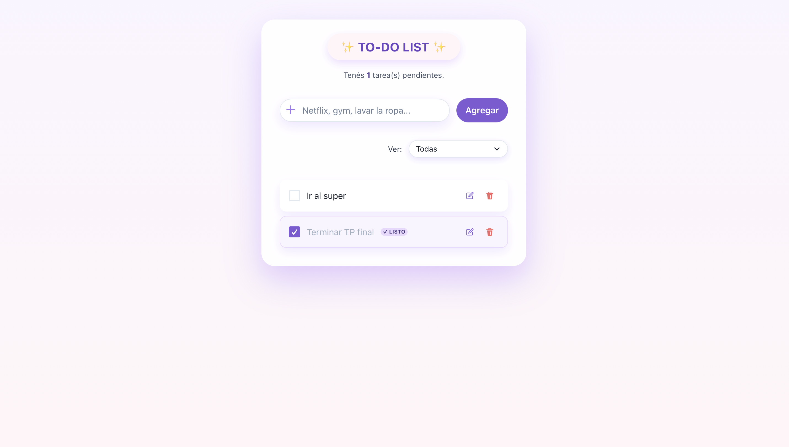
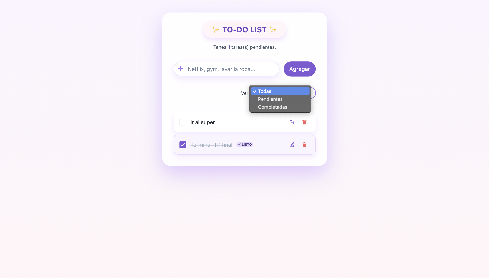
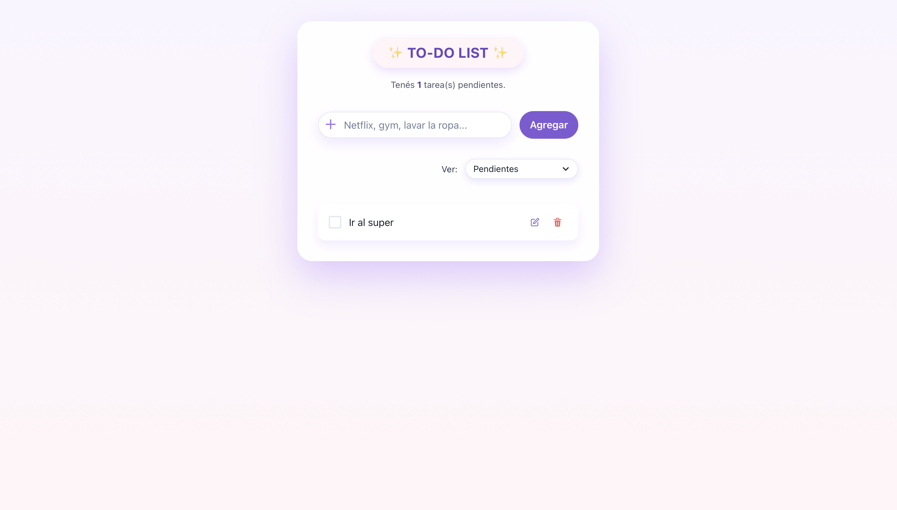

# ✨ To-Do List — Proyecto Final (React + Vite + Chakra UI)

Aplicación moderna y estética para gestionar tareas.  
Permite **agregar**, **editar**, **completar**, **eliminar** y **filtrar** tareas con una interfaz clara y minimalista, construida con **Chakra UI**.

---

## 🧩 Descripción general

Este proyecto fue desarrollado como **Trabajo Práctico Final del Módulo 4 (React)**.  
El objetivo es crear una To-Do List que:

- Sea **totalmente funcional**
- Tenga **buenas prácticas de React**
- Use **Chakra UI** como sistema de diseño
- Persista los datos en **localStorage**
- Sea visualmente agradable y usable

---

## 🖊️ Tecnologías utilizadas

### Frontend
- **React.js** (con Vite)
- **Chakra UI** (componentes estilados)
- **JavaScript ES6+**

### Estilos y diseño
- Sistema de diseño basado en **Chakra UI**  
- **Tema personalizado** (`theme.js`) con:
  - Paleta de colores `cutePurple` y `cutePink`
  - Sombras y bordes redondeados custom
- Tipografía configurada mediante **Google Fonts** (fuente sans-serif personalizada)

### Persistencia
- **localStorage** para guardar las tareas del usuario

---

## 🗂️ Estructura del proyecto

```bash
src/
 ├── assets/
 ├── components/
 │    ├── Form.jsx
 │    ├── TodoItem.jsx
 │    └── TodoList.jsx
 ├── utils/
 │    ├── filters.js        # Lógica de filtros y contadores
 │    ├── localStorage.js   # Carga y guardado en localStorage
 │    └── validators.js     # Validación de texto de la tarea
 ├── App.jsx                # Lógica principal + modales Chakra
 ├── main.jsx               # ChakraProvider + theme
 └── theme.js               # Tema personalizado Chakra UI
```

---

## ⚙️ Funcionalidades principales

### ➕ Agregar tarea
- Input con icono y botón “Agregar”.
- Validación mediante `validateTodoText`:
  - No permite tareas vacías.
  - No permite tareas demasiado largas.
- Si hay error, se muestra **modal de alerta** (Chakra Modal).

### ✏️ Editar tarea
- Cada ítem tiene un botón de edición.
- Al hacer clic se abre un **modal Chakra UI** con un `Input` para editar el texto.
- Se vuelve a validar antes de guardar.

### ✔️ Marcar como completada
- Checkbox estilado con Chakra (`Checkbox` con `colorScheme="purple"`).
- Al completarse:
  - El texto se ve tachado.
  - Se aplica un fondo suave.
  - Se muestra un badge `✓ listo`.

### 🗑️ Eliminar tarea
- Botón de eliminar con ícono de tacho.
- Antes de eliminar se abre un **modal de confirmación**:
  - Muestra el texto de la tarea.
  - Permite “Cancelar” o “Eliminar”.

### 🔍 Filtros
- Select con tres opciones:
  - `Todas`
  - `Pendientes`
  - `Completadas`
- Lógica de filtros separada en `utils/filters.js`.
- Además se muestra el **conteo de tareas pendientes**.

### 💾 Persistencia
- Al crear, editar, completar o eliminar:
  - Se actualiza el estado en React.
  - Se guarda el array de tareas en `localStorage` mediante `saveTodos`.
- Al iniciar la app:
  - Se cargan las tareas previas con `loadTodos`.

---

## 🧠 React + Chakra usados

- `useState` para:
  - Lista de tareas
  - Filtro actual
  - Estado del modal (tipo, texto, id seleccionado, etc.)

- `useEffect` para:
  - Guardar en `localStorage` cada vez que cambian las tareas

- **Chakra UI**:
  - Layout: `Box`, `Container`, `VStack`, `HStack`
  - Formularios: `Input`, `InputGroup`, `InputLeftElement`, `Select`, `Checkbox`
  - Feedback: `Badge`, `Text`, `Button`, `IconButton`
  - Modal: `Modal`, `ModalOverlay`, `ModalContent`, `ModalHeader`, `ModalBody`, `ModalFooter`
  - Iconos: `AddIcon`, `EditIcon`, `DeleteIcon`
  - Tema personalizado: colores, radios y sombras definidas en `theme.js`

---

## 🎨 Diseño y UX

- Card principal con efecto “glassmorphism” usando `Box` de Chakra.
- Sombras suaves y bordes redondeados (`borderRadius="3xl"`).
- Botones y campos de entrada con `hover` y `active` states sutiles.
- Etiquetas visuales para estado de la tarea (badge “✓ listo”).
- Modal amigable para feedback de errores y confirmaciones.

---

## 📸 Screenshots

Las siguientes capturas se encuentran en la carpeta `./screenshots/` del proyecto.

### 🌸 Vista principal


### ➕ Agregar tarea


### 📝 Editar tarea (modal)


### 🗑️ Confirmación para eliminar


### ✔️ Marcar tarea como realizada


### 📂 Menú de filtros


### 📘 Tareas completadas


### 📙 Tareas pendientes


---

## 🚀 Instalación y ejecución

```bash
git clone https://github.com/RociiioGC/TP-FINAL-202501.git
cd ubicacion de tu carpeta local
npm install
npm run dev
```

> La aplicación se ejecutará normalmente en `http://localhost:5173/`.

---


## 💖 Autora

Desarrollado por **Rocio García Cabrera**, estudiante de FRONT END - ADA ITW.