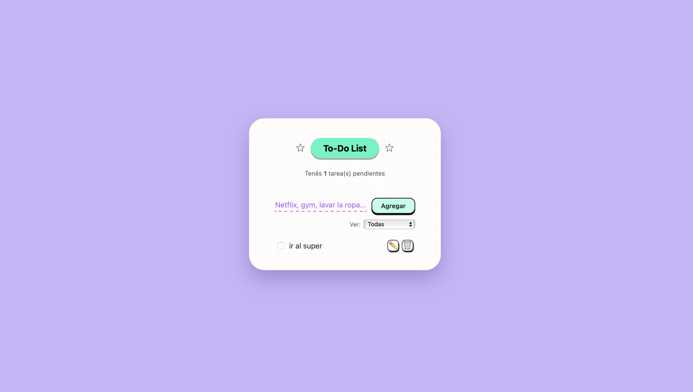
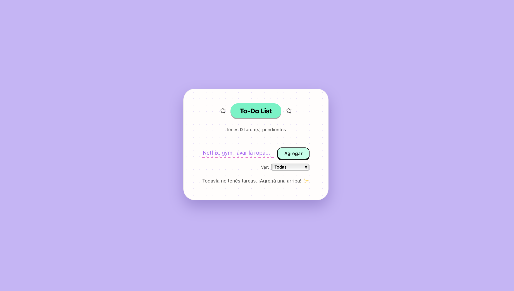
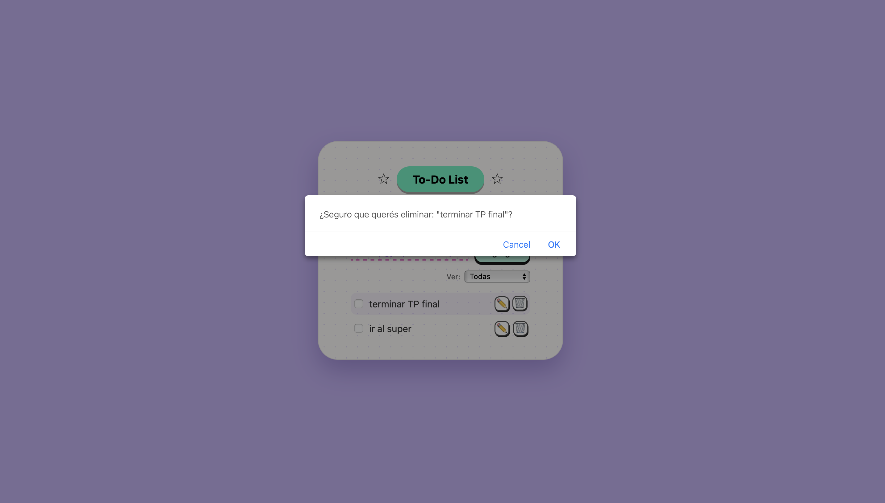

# 📝 To-Do List — Proyecto Final (ADA)

Aplicación web creada como Trabajo Práctico Final del Módulo 4 – **Vite/React**, cumpliendo los requisitos de componentes, validaciones, filtros, diseño responsive y persistencia en **localStorage**.

La app permite gestionar tareas de forma simple, rápida y visualmente atractiva.

---

## 🎯 Propósito del proyecto

- Agregar tareas  
- Marcar tareas como completadas  
- Editar y eliminar con confirmación  
- Filtrar por todas, pendientes y completadas  
- Guardar todo automáticamente en el navegador  
- Interfaz “cute”, inspirada en libretas pastel  

Además incluye:

- Código modular y componentes reutilizables  
- Carpeta `utils` obligatoria  
- Lógica separada de la UI  
- Validación estricta de datos  
- Diseño responsive mobile-first  
- Persistencia real en localStorage  

---

## 📸 Screenshots

A continuación se muestran vistas del funcionamiento de la aplicación:

| 🖼️ Layout principal | ✨ Sin tareas |
|---------------------|--------------|
|  |  |

| 📝 Editar tarea | 🗑️ Confirmación para eliminar |
|-----------------|------------------------------|
|  |  |

| 🔽 Menú de filtros | ✔️ Mostrar completadas |
|--------------------|------------------------|
|  |  |

| ⏳ Mostrar pendientes | 🟦 Tarea realizada |
|----------------------|--------------------|
|  |  |

---

## 🛠️ Tecnologías utilizadas

### Frontend
- React.js  
- Vite  
- CSS puro  
- Google Fonts — Kalam  
- LocalStorage para persistencia  

### Buenas prácticas
- Componentes desacoplados  
- Funciones puras en `/utils`  
- Validación centralizada  
- Código limpio y organizado  

---

## 📂 Estructura del proyecto

```bash
src/
 ├─ components/
 │   ├─ Form.jsx          → Input + botón “Agregar”
 │   ├─ TodoItem.jsx      → Cada tarea individual (checkbox + iconos)
 │   ├─ TodoList.jsx      → Lista renderizada de tareas
 │
 ├─ utils/
 │   ├─ localStorage.js   → Guarda / carga datos del navegador
 │   ├─ validators.js     → Validación del texto ingresado
 │   ├─ filters.js        → Lógica de filtrado y contador
 │
 ├─ App.jsx               → Lógica principal + vista general
 ├─ index.css             → Estilos globales (estética clean)
 ├─ main.jsx              → Renderizado principal
 └─ index.html
```

---

## 🚀 Cómo instalar y ejecutar el proyecto

1️⃣ **Clonar el repositorio**

```bash
git clone https://github.com/RociiioGC/TP-FINAL-202501.git
```

2️⃣ **Ingresar a la carpeta**

```bash
cd TP-FINAL-202501
```

3️⃣ **Instalar dependencias**

```bash
npm install
```

4️⃣ **Ejecutar en modo desarrollo**

```bash
npm run dev
```

---

## 📱 Responsive

Incluye media queries para pantallas menores a 480px:

- Elementos más compactos  
- Mejor espaciado en móvil  
- Botón “Agregar” adaptado  
- Iconos más pequeños  
- Tarjeta más redondeada  

---

## ✨ Funcionalidades destacadas

- Validación completa al agregar y editar  
- Animación suave de entrada para cada tarea  
- Iconos estilo “sticker” con hover cartoon  
- Estrellas animadas decorativas en el header  
- Botón “Agregar” con efecto cartoon  
- Tarjeta con fondo punteado pastel  
- Línea de input discontinua rosa (libreta cute style)  

---

## ✔️ Estado del proyecto

100% funcional — Cumple con:

- CRUD completo  
- Persistencia en navegador  
- Validaciones estrictas  
- Filtros dinámicos  
- Diseño responsive  
- Código modular  
- Uso de carpeta `utils`  
- Buenas prácticas React  

---

## 💖 Autora

Desarrollado por **Rocio García Cabrera**, estudiante de FRONT END - ADA ITW.